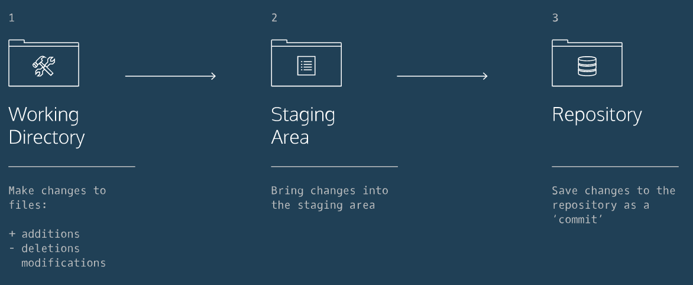

#git cheatsheet

### git workflows

### git commands

1. git init

2. git status

3. git diff <filename>
>compare between working and staging area

4. git commit -m <comment>

5. git log
* option
    * --oneline
