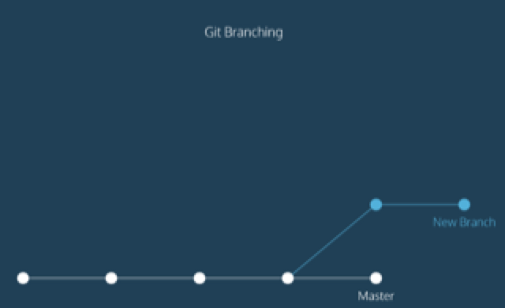

#git cheatsheet

### git workflows


### basic commands

1. git init

2. git status

3. git diff <filename>
>compare between working and staging area

4. git commit -m <comment>

5. git add <filename>

6. git log
    * option
        * --oneline

### Backtracking

1. git show HEAD
>HEAD: most recently commit
>output:git log commands for HEAD

2. git checkout HEAD <filename>
>discard the change in working directory, last commited file restored

3. git reset HEAD <filename>
>discard the change in staging directory, last commited file restored 
    * git reset SHA
        * first 7 characters in SHA needed
        * to earn SHA, `git log --oneline`

### Branching


1. git branch <branch_name>
>check, make branch
    * option
        * -d <branch_name> : delete branch
2. git checkout <branch_name>
>change branch

3. how to merge

```
git checkout master
git merge <branch_name>
```

4. merge conflict

>occured when you commited both master and other branch

* git marking
```
<<<<<<< HEAD
master version of line
=======
fencing version of line
>>>>>>> fencing
```
* you must delete one
